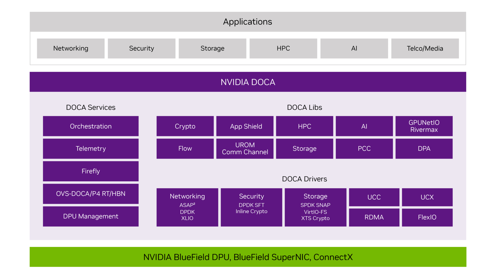

# doca-comch
The purpose of this research project is to investigate the offloading and hw acceleration of the compute-intensive LDPC function from the O-DU High-PHY layer of the 5G NR in a NVIDIA BlueField-3 DPU, according to O-RAN 7.2x split, to enhance the function performance (throughput, latency and energy efficiency).

## Table of Contents
- [Low-Density Parity-Check (LDPC) Codes](#low-density-parity-check-ldpc-codes)
    - [What LDPC Codes are](#what-ldpc-codes-are)
    - [How They Work](#how-they-work)
    - [Applications](#applications)
    - [Comparison with Other Codes](#comparison-with-other-codes)
    - [Key 3GPP Specifications for 5G NR](#key-3gpp-specifications-for-5g-nr)
- [Requirements](#requirements)
- [DOCA SDK](#doca-sdk)
  - [Installation Instructions](#installation-instructions)
  - [Project Structure](#project-structure)
  - [Compilation of the Clients and Servers](#compilation-of-the-clients-and-servers)
- [doca_comch API](#doca_comch-api)
  - [DOCA Comch Data Path Client/Server](#doca-comch-data-path-clientserver)
  - [Running the DOCA Comch Data Path Client/Server](#running-the-doca-comch-data-path-clientserver)
- [ArmRAL](#armral)
  - [Installation Instructions](#installation-instructions-1)
  - [Compilation and Building the ArmRAL shared library](#compilation-and-building-the-armral-shared-library)
  - [Installation of the ArmRAL](#installation-of-the-armral)
  - [DPU-ArmRAL Integration](#dpu-armral-integration)
- [NVIDIA BlueField-3 DPU](#nvidia-bluefield-3-dpu)
    - [Technical Specification](#technical-specification)
- [OpenAirInterface (OAI)](#openairinterface-oai)
  - [Core Components](#core-components)
  - [OAI and Functional Splits](#oai-and-functional-splits)
  - [O-RAN 7.2x Split](#o-ran-72x-split)
  - [3GPP Split 2](#3gpp-split-2)
  - [Installation Instructions](#installation-instructions-2)
  - [OAI-Host Integration](#oai-host-integration)
  - [Instantiation of OAI 5GC, gNB and nrUE](#instantiation-of-oai-5gc-gnb-and-nrue)
- [Acceleration Aspects](#acceleration-aspects)
    - [Arm Cortex-A78](#arm-cortex-a78)
    - [ArmRAL Characteristics](#armral-characteristics)
    - [Compiler Optimization Level](#compiler-optimization-level)
- [Experiments](#experiments)
- [Contributing](#contributing)

---
## Low-Density Parity-Check (LDPC) Codes
In 5G, LDPC codes were chosen as the channel coding scheme for the data channels (like the Physical Downlink Shared Channel (PDSCH) and Physical Uplink Shared Channel (PUSCH)). The 4G LTE uses the Turbo codes.

The details of the LDPC codes, including the specific Base Graphs (BG1 and BG2), parity-check matrices, and encoding and decoding procedures, are defined in 3GPP TS 38.212. This standard provides the precise mathematical framework and algorithms that all 5G devices and network equipment must implement to ensure interoperability and reliable data transmission.

## What LDPC Codes are
Low-Density Parity-Check (LDPC) codes are a class of highly efficient linear block codes used for error correction. They are used in digital communication systems to transmit data reliably over noisy channels. Unlike simpler error-correcting codes, LDPC codes are designed to be extremely powerful, approaching the theoretical maximum limit for data transmission, as defined by the Shannon-Hartley theorem.

The "low-density" part of the name refers to the sparse structure of their parity-check matrix. This matrix is used to encode and decode the data, and in an LDPC code, it contains a very small number of ones compared to zeros. This sparsity is the key to their efficiency, allowing for high-performance decoding algorithms that can be implemented in a practical manner.

## How They Work
At a high level, LDPC codes work by adding a certain amount of redundant information, or parity bits, to the original data stream. This creates a longer codeword that contains the original data and the added bits.

* *Encoding:* The sender takes the original data bits and, using the parity-check matrix, generates a set of parity bits. The combination of the original data and the new parity bits forms the encoded codeword.

* *Transmission:* This codeword is then transmitted over a communication channel, such as Wi-Fi or a satellite link. During transmission, noise and interference can corrupt some of the bits, causing them to flip from a 0 to a 1 or vice-versa.

* *Decoding:* The receiver gets the potentially corrupted codeword. The sparse parity-check matrix allows for an iterative decoding process, often visualized on a Tanner graph. The decoder uses this graph to check the consistency of the received bits. By repeatedly checking and correcting bits that violate the parity checks, the decoder can, with high probability, reconstruct the original, uncorrupted data.

## Applications
Because of their excellent performance, LDPC codes have become the standard for modern high-speed communication systems. They are a core component in:

* 5G and Wi-Fi: They are the primary forward error correction (FEC) codes for data channels, ensuring fast and reliable data transfer.

* Satellite Communication: They are used in satellite systems to combat the long-distance signal degradation and noise.

* Digital Video Broadcasting (DVB): They ensure the integrity of broadcast signals for digital television.

## Comparison with Other Codes
LDPC codes are often compared to Turbo Codes, another class of high-performance error-correcting codes. While both are powerful, LDPC codes generally have superior performance at very high data rates and are often easier to implement in hardware. This has led to LDPC codes being the preferred choice for many recent communication standards.

### Key 3GPP Specifications for 5G NR
The 3GPP has a series of Technical Specifications (TS) that define every aspect of the 5G standard. For the physical layer, the most relevant documents are:

* *TS 38.201:* This is the "General description" for the physical layer. It provides an overview of the key features, physical channels, and signals.

* *TS 38.212:* This is the most crucial document for your specific question. It is titled "Multiplexing and channel coding" and it defines the channel coding schemes for the 5G physical layer. This is where you'll find the detailed specifications for LDPC coding for data channels and Polar coding for control channels.

* *TS 38.211:* This specification covers "Physical channels and modulation," detailing the physical layer signals, modulation mapping (like QPSK, 16QAM, 64QAM), and the frame structure.

* *TS 38.213:* This document focuses on "Physical layer procedures" and specifies how the UE (User Equipment) and the network interact, covering things like power control, synchronization, and random access.

*  *TS 38.214:* This standard ...

---
## Requirements
* **Hardware**
    * Host Intel XEON Gold 6526Y x86_64 with 64 cores
    * NVIDIA BlueField-3 DPU - Arm Cortex-A78AE aarch64 16 cores 

* **Software**
    * DOCA SDK 3.0.0
    * ArmRAL 25.07
    * OpenAirInterface 2025.w31

* **ArmRAL**
    * To use the Cyclic Redundancy Check (CRC) functions, the Gold sequence generator, and the convolutional encoder, the library must run on a core that supports the AArch64 PMULL extension (check in lscpu, /proc/cpuinfo)

* **Linux Ubuntu**
    * OAI
        * Linux Low-latency Kernel

---
## DOCA SDK

This project makes usage of the NVIDIA DOCA™ Framework, which has compound by DOCA SDK to create and deliver applications and services on top of the BlueField networking platform. The project uses the harnessing the power of NVIDIA's BlueField-3 DPU (Data Processing Unit) to offload and accelerate a 5G NR High-PHY layer function. A DOCA SDK Overview is in [DOCA Overview](https://docs.nvidia.com/doca/sdk/doca+overview/index.html).

The offloading and hw acceleration was developed based on an NVIDIA® BlueField®-accelerated application (DOCA Communication Channel API) and the drivers for both the host and DPU.




### Installation Instructions

Installation instructions for both host and BlueField image can be found in the [DOCA Installation Guide for Linux](https://docs.nvidia.com/doca/sdk/DOCA+Installation+Guide+for+Linux).

DOCA shall be installed on the host or on the BlueField-3 DPU, and the DOCA components is found under the /opt/mellanox/doca directory. These include the traditional SDK-related components (libraries, header files, etc.) as well as the DOCA samples, applications and tools.

---
### Project Structure

```
├── client/
│   └── opt/
|   |   └── mellanox/
│   |       └── doca/
│   |           ├── applications/
│   |           ├── include/
|   |           ├── infrastructure/
|   |           ├── lib/
|   |           ├── samples/
|   |           |   ├── common.c
|   |           |   ├── common.h
|   |           |   ├── .../
|   |           |   ├── doca_comch/
|   |           |   |   ├── comch_ctrl_path_common.c
|   |           |   |   ├── comch_ctrl_path_common.h
|   |           |   |   ├── comch_data_path_high_speed_common.c
|   |           |   |   ├── comch_data_path_high_speed_common.h
|   |           |   |   ├── meson.build
|   |           |   |   ├── nrLDPC_common.c
|   |           |   |   ├── nrLDPC_common.h
|   |           |   ├── nrLDPC_decod_client/
|   |           |   |   ├── meson.build
|   |           |   |   ├── nrLDPC_decod.c
|   |           |   |   └── nrLDPC_decod_client.c
|   |           |   ├── nrLDPC_defs.h
|   |           |   ├── nrLDPC_encod_client/
|   |           |   |   ├── meson.build
|   |           |   |   ├── nrLDPC_encod.c
|   |           |   |   └── nrLDPC_encod_client.c
|   |           |   ├── nrLDPC_init/
|   |           |   |   ├── meson.build
|   |           |   |   └── nrLDPC_initcall.c
|   |           |   ├── nrLDPC_shutdown/
|   |           |   |   ├── meson.build
|   |           |   |   └── nrLDPC_shutdown.c
|   |           |   └── vDU/
|   |           |       ├── meson.build
|   |           |       └── vdu_high_phy_ldpc_codes.c
|   |           └── tools/
├── server/
│   └── opt/
|       └── mellanox/
│           └── doca/
│               ├── applications/
│               ├── include/
|               ├── infrastructure/
|               ├── lib/
|               ├── samples/
|               |   ├── common.c
|               |   ├── common.h
|               |   ├── .../
|               |   ├── doca_comch/
|               |   |   ├──
|               |   |   ├── 
|               └── tools/
├── images/
│   └── doca-software.jpg
└── README.md
```

### Compilation of the Clients and Servers

To compile and build the doca_comch API:

* **Host build commands**

```bash
cd /opt/mellanox/doca/services/doca_comch
meson /tmp/build
ninja -C /tmp/build
```

The generated clients are located under the /tmp/build/ directory.

* **DPU build commands**  
```bash
# For LDPC Decoder Server
cd /opt/mellanox/doca/services/doca_comch/nrLDPC_decod_server
meson /tmp/build
ninja -C /tmp/build

# For LDPC Encoder Server  
cd /opt/mellanox/doca/services/doca_comch/nrLDPC_encod_server
meson /tmp/build
ninja -C /tmp/build
```

The generated servers are located under the /tmp/build/ directory.

```bash
# host (client)
cd /tmp/build
ls -la
    compile_commands.json
    .gitignore
    .hgignore
    libldpc_armral.so
    libldpc_armral.so.p
    libldpc_armral_static.a
    libldpc_armral_static.a.p
    meson-info
    meson-logs
    meson-private
    .ninja_deps
    .ninja_log

# DPU (server)
cd /tmp/build
ls -la


```

The library libldpc_armral.so (host side) will be built again when the OAI 5G NR executables are generated.


### doca_comch API

DOCA Comch provides a communication channel between client applications on the host and servers on the BlueField Arm. It introduces features such as high-performance data path over the consumer-producer API, as well as working with DOCA progress engine and other standard DOCA Core objects.

Benefits of using DOCA Comch:

* Security – the communication channel is isolated from the network
* Network independent – the state of the communication channel does not depend on the state and configuration of the network
* High bandwidth, low latency, zero-copy, multi-producer, multi-consumer API

DOCA Communication Channel library let you set a direct communication channel between the host and the DPU. The channel is run over RoCE/IB protocol and is not part of the TCP/IP stack.


#### DOCA Comch Data Path Client/Server

The DOCA Comch Data Path Client/Server sets up a client-server connection between the host and BlueField Arm.

The connection is used to create a producer and consumer on both sides to communicate across the two fastpath connections.

Basically, the logic includes:

1. Locates the DOCA device.
2. Initializes the core DOCA structures.
3. Initializes and configures client/server contexts.
4. Initializes and configures producer/consumer contexts on top of an established connection.
5. Submits post-receive tasks for population by producers.
6. Submits send tasks from producers to write to consumers.
7. Stops and destroys producer/consumer objects.
8. Stops and destroys client/server objects.


#### Running the DOCA Comch Data Path Client/Server

First start running the server on DPU side:

```bash
# For LDPC Decoder Server
cd /tmp/build
    ./nrLDPC_decod_server -p 03:00.0 -r 03:00.0
```

after that, the client on host side:

```bash
# For LDPC Encoder Server  
cd /tmp/build
    ./nrLDPC_encod_server -p 03:00.0 -r 03:00.0
```

The OAI 5G CN stack shall be running and the servers nrLDPC_decod_server and nrLDPC_encod_server (DPU side) with the Arm LDPC kernels implementation shall be started (this order does not matter), and then the entire OAI 5G NR stack shall be brought up and running (with the gNB and the nrUE). All components will be running on the same host.

The nrUE (nr-uesoftmodem) shall be started with the flag '--loader.ldpc.shlibversion _armral' that indicates the OAI Loader to load and executed the customized 'libldpc_armral.so' instead of the standard ldpc library from OAI. This is the doca_comch shared library that contains the clients nrLDPC_decod_client and nrLDPC_encod_client that implement the OAI interfaces.

When a 5G OAI DU High-PHY layer needs to perform LDPC decoding (for the uplink) or encoding (for the downlink), it calls a function in the shared library libldpc_armral.so. This library, loaded by the OAI Loader, then offloads the LDPC task from the host CPU to a DPU server. The DOCA Comch client on the host communicates through a established PCIe communication channel with the DOCA Comch server on the DPU to handle this offload. Once offloaded, the ArmRAL LDPC kernel runs efficiently on the DPU's Arm multicore CPUs.

---
## ArmRAL

ArmRAL is an open-source software library that provides building blocks (functions or kernels) required by RAN L1 that run on CPU for optimized signal processing and related maths functions for enabling 5G Radio Access Network (RAN) deployments. It leverages the efficient vector units available on Arm cores that support the Armv8-a architectures (Neon, SVE, SVE2 …) and SIMD/Vector capabilities, offering an API that can be integrate into L1 stack to accelerate 5G NR signal processing workloads. The functions/kernels include:

* Matrix and vector arithmetic, such as matrix multiplication.
* Fast Fourier Transforms (FFTs).
* Digital modulation and demodulation.
* Cyclic Redundancy Check (CRC).
* Encoding and decoding schemes, including Polar, Low-Density Parity Check (LDPC), and Turbo.
* Compression and decompression.

This project uses the ArmRAL Low-Density Parity Check (LDPC) decoding and encoding functions.

Download ArmRAL from [ArmRAL GitLab](https://gitlab.arm.com/networking/ral) or from [ArmRAL Releases](https://gitlab.arm.com/networking/ral/-/releases).


### Installation Instructions

The tutorial to build and install the Arm RAN Acceleration Library (ArmRAL) can be found in the [Get started with Arm RAN Acceleration Library](https://developer.arm.com/documentation/102249/2504/Tutorials/Get-started-with-Arm-RAN-Acceleration-Library?lang=en).


### Compilation and Building the ArmRAL shared library

The Arm Cortex-A78AE is a 64-bit Armv8.2-A architecture CPU. It is needed a toolchain that can target AArch64 (arm64).

* Compiling on an x86 host for an A78AE target running on Ubuntu, and also for Hipervisor QEMU, use the cross toolchain:
```bash
aarch64-linux-gnu-gcc
aarch64-linux-gnu-g++

aarch64-linux-gnu-gcc -march=armv8.2-a -mcpu=cortex-a78 -O2 -o myprog myprog.c
aarch64-linux-gnu-g++ -march=armv8.2-a -mcpu=cortex-a78 -O2 -o myprog myprog.cpp
```
* Compiling natively on an AArch64-based machine

Building directly on the Cortex-A78AE CPU (native build, e.g. BlueField DPU), use native compilers:
```bash
gcc -march=armv8.2-a -mcpu=cortex-a78 -O2 -o myprog myprog.c
g++ -march=armv8.2-a -mcpu=cortex-a78 -O2 -o myprog myprog.cpp
```
* Building the shared library

Download the last ArmRAL release
```bash
# host login
username@intrig:~$ mkdir armral
username@intrig:~/armral$ wget https://gitlab.arm.com/networking/ral/-/archive/armral-25.07/ral-armral-25.07.tar
```
Copy the tar file to DPU
```bash
# DPU login
username@localhost:~$ mkdir armral
username@localhost:~/armral$ scp vlademir@10.1.1.169:/home/vlademir/armral/ral-armral-25.07.tar .

username@localhost:~/armral$ tar -xvf ral-armral-25.07.tar
```
Tools
Ensure the installation of gcc, g++ and cmake (x86_64) on host
Ensure the installation of gcc, g++ and cmake (arm64) on DPU

Build the ArmRAL lib

Explicitly enable NEON/SIMD intrinsics, even though Cortex-A78AE supports it. For gcc and g++ on AArch64, NEON intrinsics requires:

* +simd - always enable NEON explicitly (+simd) to ensure intrinsics like vmull_p64 work correctly
* +crypto - optional, enables ARMv8 crypto instructions (for BlueField-3 / A78AE)
* -mcpu=cortex-a78 - optimizes for the specific CPU
* -O2, -O3 or -Ofast - optimization level

Use NEON/SIMD explicitly with these flags:

-DCMAKE_C_FLAGS="-O2 -march=armv8.2-a+simd+crypto -mcpu=cortex-a78" \
-DCMAKE_CXX_FLAGS="-O2 -march=armv8.2-a+simd+crypto -mcpu=cortex-a78"

```bash
username@localhost:~/armral$ mkdir build
username@localhost:~/armral$ cd build

username@localhost:~/armral/build$ sudo cmake -DCMAKE_INSTALL_PREFIX=/home/vlademir/armral/ral-armral-25.07/build /home/vlademir/armral/ral-armral-25.07/ -DCMAKE_BUILD_TYPE=Release -DCMAKE_C_COMPILER=gcc -DCMAKE_C_FLAGS="-O2 -march=armv8.2-a+simd+crypto -mcpu=cortex-a78" -DCMAKE_CXX_FLAGS="-O2 -march=armv8.2-a+simd+crypto -mcpu=cortex-a78" -DBUILD_TESTING=On -DARMRAL_TEST_RUNNER=bf-3-aarch64 -DBUILD_EXAMPLES=On -DBUILD_SHARED_LIBS=On -DARMRAL_ARCH=NEON -DBUILD_SIMULATION=On

username@localhost:~/armral/ral-armral-25.07/build$ sudo make
```
### Installation of the ArmRAL

Ensure you have write access for the installation directories:

* For a default installation, you must have write access for /usr/local/lib/, for the library, and /usr/local/include/, for the header files.
* For a custom installation, you must have write access for <install-dir>/lib/, for the library, and <install-dir>/include/, for the header files.

* Installation of the library
```bash
make install
```
The shared library 'libarmral.so' will be under <install-dir>/lib/

An install creates an install_manifest.txt file in the library build directory. install_manifest.txt lists the installation locations for the library and the header files.


### DPU-ArmRAL Integration

**\[Content on how ArmRAL is integrated with the DPU goes here.\]**

---
## NVIDIA BlueField-3 DPU

### Technical Specification

The Arm Cortex-A78AE implements the Armv8.2-A architecture baseline with some optional extensions.

Cortex-A78AE includes NEON (Advanced SIMD) as part of the Armv8-A baseline.

NEON is 128-bit wide and is the standard SIMD unit for most Arm cores up through v8.x.

Cortex-A78AE = NEON (128-bit Advanced SIMD).

To use the Cyclic Redundancy Check (CRC) functions, the library must run on a core that supports the AArch64 PMULL extension (check in DPU with lscpu, /proc/cpuinfo).

---
## OpenAirInterface (OAI)

OpenAirInterface (OAI) is an open-source software platform that provides a complete, software-based implementation of 4G (LTE) and 5G (NR) cellular network standards. It essentially allows to run a full mobile network, from the core network to the radio access network (e.g., base station and user equipment) on standard computing hardware.


### Core Components

OpenAirInterface is divided into two main parts that work together to form a cellular network:

* OAI Radio Access Network (OAI-RAN): This part handles the radio communication. It includes the software for both the eNodeB (the 4G base station) and gNodeB (the 5G base station), as well as the User Equipment (UE) or device modem software.

* OAI Core Network (OAI-CN): It implements the Evolved Packet Core (EPC) for 4G and the 5G Core Network (5GC), which manage subscriber authentication, data routing, and mobility.

These functional splits are a core concept of Open RAN (O-RAN) because they allow for interoperability between different vendors. OpenAirInterface is a powerful tool for exploring these splits.


### OAI and Functional Splits

OAI implements the two most common splits, O-RAN 7.2x and 3GPP split 2.


#### O-RAN 7.2x Split

This is the most widely adopted and a defining characteristic of O-RAN. The O-RAN 7.2x split divides the Physical Layer (PHY) of the radio protocol stack between the Radio Unit (O-RU) and the Distributed Unit (O-DU).

* O-RU (Radio Unit): Handles the physical RF (Radio Frequency) functions, such as digital-to-analog conversion, as well as the lower-level PHY tasks like Inverse Fast Fourier Transform (IFFT) and Fast Fourier Transform (FFT).

* O-DU (Distributed Unit): Manages the higher-level PHY functions, including channel coding and decoding (Polar and LDPC codes), as well as the Medium Access Control (MAC) layer.

This split is a balance between centralization and fronthaul bandwidth. By keeping some PHY processing in the O-RU, it reduces the amount of data that needs to be sent over the fronthaul (the link between the O-RU and O-DU), making it a more practical choice for a wider range of deployments. The O-RAN Alliance standardized this split to promote vendor interoperability.


#### 3GPP Split 2

This is the higher-level split defined by the 3GPP standards body. In this split, the entire Physical Layer (PHY) resides in the Distributed Unit (DU), while the Centralized Unit (CU) handles the Radio Resource Control (RRC) and Packet Data Convergence Protocol (PDCP) layers. The interface is between the CU and the DU.

* CU (Centralized Unit): Handles higher-level functions, including RRC and PDCP, which are less time-sensitive.

* DU (Distributed Unit): Handles the entire MAC, Radio Link Control (RLC), and PHY layers.

Compared to O-RAN 7.2x, this split requires less intelligence at the cell site (the DU). However, it places greater demands on the fronthaul network (the link between the DU and the Radio Head), as a large amount of raw baseband data needs to be transmitted. While defined by 3GPP, this split is less commonly used in commercial O-RAN deployments than the 7.2x split due to its stricter transport requirements.


### Installation Instructions

**\[Content on OAI installation goes here.\]**

### OAI-Host Integration

**\[Content on OAI integration with the host goes here.\]**

### Instantiation of OAI 5GC, gNB and nrUE

**\[Content on how to run OAI 5GC, gNB, and nrUE goes here.\]**

---
## Acceleration Aspects

### Arm Cortex-A78
* Arm NEON CPU intrinsics
  * NEON intrinsics - functions mapping to SIMD instructions
  * Architecture, instruction set, SIMD - define what intrinsics are available
* Cache alignment, vector programming - techniques to use intrinsics effectively

Code bloat happens when the size of a compiled program becomes much larger than necessary, usually because of excessive or redundant code generation. This can negatively impact instruction cache usage, memory footprint, and sometimes performance.

Some common causes:

Aggressive optimizations

For example, loop unrolling duplicates the loop body several times to reduce branch overhead, but too much unrolling creates many copies of the same instructions → code gets much bigger.

Inlining

The compiler replaces a function call with the full function body (to avoid call overhead).

If the function is used many times, this can lead to large amounts of repeated code.

Templates in C++

Each instantiation of a template with a different type produces a new version of the code → large binaries if templates are overused.

Autovectorization and Intrinsics

Sometimes compilers emit long sequences of SIMD instructions (or multiple fallback code paths for different CPUs), inflating binary size.

👉 In short:

Pros: Code bloat sometimes improves speed (fewer branches, more inlined code, better pipelining).

Cons: Larger binaries, worse instruction cache locality, potential slowdown if I-cache misses dominate.

For LDPC decoding/encoding (compute-heavy, tight loops):

A bit of loop unrolling and SIMD inlining is good.

But excessive unrolling/inlining - code bloat may hurt performance, especially on embedded CPUs like Cortex-A78 with smaller caches.


### ArmRAL Characteristics

**\[Content on encoding/decoding such as algorithm implemented, Base Graph, quasi-cyclic (QC) parity-check matrix, etc go here.\]**

### Compiler Optimization Level

'-O2' (default recommended for release builds)
* Enables nearly all optimizations that do not involve space–speed tradeoffs
* Includes loop optimizations, instruction scheduling, vectorization (SIMD), etc.
* Keeps compilation time reasonable
* Very widely used for production builds because it balances speed and stability

'-O3' (aggressive optimizations)
* Enables everything from '-O2' plus more aggressive optimizations, such as
  * Function inlining (even across more boundaries)
  * Loop unrolling - a compiler optimization technique where a loop’s iterations are expanded (“unrolled”) into multiple copies of the loop body to reduce loop overhead and     improve performance
  * Vectorization heuristics (trying to use SIMD more)
  * More speculative optimizations
* Can make code faster, but
  * May also increase binary size
  * Sometimes slows down performance due to cache misses (code bloat) - code bloat happens when the size of a compiled program becomes much larger than necessary, usually       because of excessive or redundant code generation. This can negatively impact instruction cache usage, memory footprint, and sometimes performance
  * In rare cases can expose compiler bugs or undefined behavior in code

'-Ofast'
* Includes -O3 plus optimizations that may break strict standards compliance (e.g., assumes math operations are associative, ignores corner cases like NaN handling).
  NaN (Not a Number) is a special value in floating-point arithmetic (with types like float or double) that represents an undefined or unrepresentable result
* Best for maximum performance if you don’t care about IEEE/ISO compliance

Recommendation
* Option '-O3'
  * Enables aggressive loop unrolling, vectorization, and inlining
  * LDPC encoding/decoding involves lots of loops, matrix operations, and bit manipulations, so '-O3' often gives a significant speedup over '-O2'
  * Modern ARM CPUs like Cortex-A78AE benefit from aggressive instruction scheduling and NEON vectorization
* Option '-Ofast'
  * If the code doesn’t rely on strict IEEE floating-point behavior (less relevant for LDPC, mostly integer/bit operations)
  * If the focus is to squeeze maximum performance
* Keep -march=armv8.2-a+simd+crypto -mcpu=cortex-a78 alongside it
  * This enables NEON intrinsics, which your LDPC function likely uses
  * The compiler can auto-vectorize loops in addition to your NEON intrinsics

Practical approach
* Compile LDPC function with '-O2' first as a baseline
* Benchmark throughput (bits/sec or code blocks/sec)
* Recompile with '-O3', benchmark again
* If safe, try '-Ofast' and compare
Often, '-O3' gives 20–50% speedup over '-O2' for compute-heavy loops. '-Ofast' may give a few more percent, but can risk subtle differences.

Notes
* Always enable NEON explicitly (+simd) to ensure intrinsics like vmull_p64 work correctly.
* Make sure the LDPC function is aligned and uses vector-friendly memory layouts; otherwise, -O3 optimizations can’t fully help.
* Profile with perf or gprof to see which loops benefit most.
---
* DPU Hardware
  * RoCE/IB
  * 200 Gbps (InfiniBand)
  * dmma (shared memory)
  * zero copy
* High Performance Computing (HPC)
  * Producer / Consumer model (DOCA comch API) - Producers generate tasks (data or events), and Consumers process the tasks (data or events)
  * Software parallelized with Pthreads (POSIX Threads) lib - multithreading programming
  * Thread Pool to handle task queue

---
## Experiments

**\[Content on experiments and use cases go here.\]**

---
## Contributing

**\[Content on contribution guidelines goes here.\]**


BLER (Block Error Rate) per Watt
3GPP TS 36.213 - Physical Layer Procedures
3GPP TS 36.321 - MAC Layer Specifications
3GPP TS 36.331 - RRC Protocol Specification
